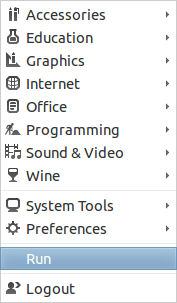
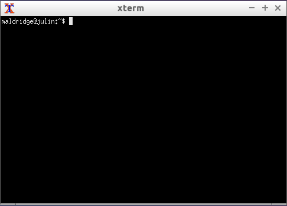
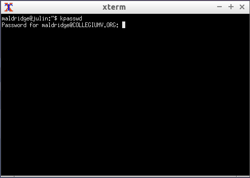

## Change Password

1. Log in on a Lounge Workstation.

2. Click on the menu at the bottom left corner.

3. Select the second item from the bottom, "Run".
 - 

4. Type: `xterm` and press enter.
 - 
 - If you get a warning box telling you "Failed to execute child process," you 
   mistyped `xterm`.
 - You should get a window in the middle of the screen named "xterm".
 - 

5. Type the following: `kpasswd`
 - **A Note About Passwords**
	  * Most systems people give people feedback while they type their
	    passwords, normally in the form of dots, or asterisks.
	  * This behaviour is not repeated in `kpasswd`, for security reasons.
	    Instead of showing dots, it will simply show nothing. Rest assured,
	    the computer is getting your key presses.

6. You will be greeted with a prompt: "Password for YourUsername@COLLEGIUMV.ORG"
 - Here, you type the password you used to log in.
 - You will not receive feedback, for security reasons.
 - If you type it wrong, you will get an error. In that case, just type
   `kpasswd` again.
 - 

7. If you typed your current password correctly, you will be presented with 
   another prompt: "Enter new password."
 - Here, you type your desired password.

8. After pressing enter, you will be presented with another prompt: "Enter it 
   again."
 - Type your desired password again, to make sure it was entered correctly the 
   first time.

9. If you typed your passwords correctly, you will be told "Password changed."
 - At this point, you can just close the "xterm" window.

10. If you did not type your password correctly the second time, just type
   `kpasswd` again and start over.
